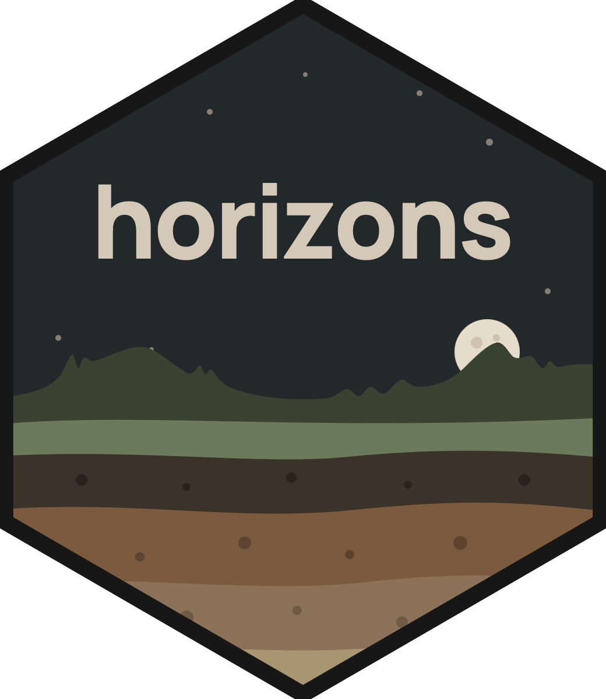

# horizons 

<!-- badges: start -->
[](https://github.com/S-Leuthold/horizons/actions/workflows/R-CMD-check.yaml)
[](https://codecov.io/gh/S-Leuthold/horizons)
[](https://www.repostatus.org/#wip)
[](LICENSE.md)
<!-- badges: end -->

horizons is an R package for building and comparing predictive models from mid-infrared (MIR) soil spectra. It reads spectra directly from Bruker OPUS files or CSVs and carries them through a whole modeling workflow. The core of its design is a factorial comparison: every combination of spectral preprocessing, feature selection and model type is evaluated side by side. The best models can then be stacked into ensembles to predict new samples, and horizons attempts to quantify the uncertainty of those predictions.

This package grew out of my own analysis scripts over the last year and a half. At first it was necessity: running these comparisons in parallel meant the code had to live in a package. Along the way I've spent a lot of time fiddling with it, somewhere between a passion project and my day job. It's the same workflow I use for all my MIR work, and hopefully it's useful to others thinking about the same problems. It's still under active development, and I'll keep maintaining and updating it, but it continues to be a work in progress.

> [!NOTE]
> horizons is pre-1.0. The pipeline runs end to end, but the API can still change between minor versions. It is not on CRAN.

## Installation

```r
# install.packages("remotes")
remotes::install_github("S-Leuthold/horizons")
```

Two dependencies are not on CRAN and are pinned in the `Remotes` field of `DESCRIPTION`, so `remotes::install_github()` installs them automatically:

- [`spectral-cockpit/opusreader2`](https://github.com/spectral-cockpit/opusreader2) reads Bruker OPUS files.
- [`S-Leuthold/plsmod-fork`](https://github.com/S-Leuthold/plsmod-fork) is a fork of `plsmod` with a fix the `plsr` model type needs during tuning.

The PLS model and the PLS similarity space in `select_training()` use `mixOmics`, which comes from Bioconductor. Install it first if you need either:

```r
BiocManager::install("mixOmics")
```

## The pipeline

```r
library(horizons)

hz <- spectra("path/to/opus_files") |>             # read spectra (OPUS files or CSV)
  parse_ids(format = "{sampleid}_{replicate}") |>  # sample IDs from the file names
  average() |>                                     # average replicate scans
  standardize() |>                                 # common wavenumber grid
  add_response(source = lab_data, variable = "SOC") |>
  configure(
    models            = c("rf", "cubist", "plsr"),
    preprocessing     = c("snv", "snv_deriv1"),
    feature_selection = c("none", "pca"),
    transformation    = c("none", "log")
  ) |>
  validate() |>                                    # pre-flight checks
  evaluate() |>                                    # cross-validate every configuration
  fit(n_best = 3)                                  # refit the best, with intervals

new_spectra <- spectra("path/to/new_files") |>     # prepared like the training spectra
  parse_ids(format = "{sampleid}_{replicate}") |>
  average() |>
  standardize()

predict(hz, new_spectra)                           # predictions, intervals, flags
```

To run the whole pipeline on synthetic spectra, with no data of your own, see [`inst/examples/end-to-end-pipeline.R`](inst/examples/end-to-end-pipeline.R).

### Main verbs

- `spectra()` reads spectra from Bruker OPUS files or CSV.
- `parse_ids()` pulls sample identifiers out of OPUS file names, and `average()` averages replicate scans.
- `standardize()` puts spectra on a common wavenumber grid.
- `add_response()` joins laboratory measurements to the spectra.
- `configure()` sets up the factorial comparison across models (random forest, Cubist, XGBoost, LightGBM, PLS regression, elastic net, SVM, neural network, MARS), spectral preprocessing (raw, Savitzky-Golay, SNV, first and second derivatives), feature selection (PCA, correlation, Boruta, CARS) and response transformations (log, log10, square root).
- `validate()` checks the data and the grid before anything runs.
- `evaluate()` tunes and cross-validates every configuration, in parallel on any [future](https://future.futureverse.org) backend.
- `fit()` refits the best configurations, with conformal prediction intervals and an applicability-domain check.
- `ensemble()` stacks fitted models into an ensemble.
- `predict()` predicts new samples, with intervals and applicability flags.
- `select_training()` draws a training set from a reference spectral library, such as the Kellogg Soil Survey Laboratory MIR library from the Open Soil Spectral Library, for samples without laboratory measurements of their own.

## Current development

- Multiple approaches to cross-validation, including holding out whole sites or fields.
- Modeling several soil properties at once, including compositional properties such as texture.
- Training on local samples combined with a reference library.
- Better parallelism, with lower memory use per worker and nested parallelism across configurations and folds.

## Contributing

Contributions are welcome: bug reports, questions, and pull requests. See [CONTRIBUTING.md](CONTRIBUTING.md).

## Citation

If you use horizons, please cite the package:

```
Leuthold, S. (2026). horizons: Build and compare predictive models for
mid-infrared soil spectroscopy in R. https://github.com/S-Leuthold/horizons
```

GitHub's "Cite this repository" button, under the About section, gives the same citation in other formats.

## License

MIT. See [`LICENSE.md`](LICENSE.md).

## Acknowledgements

horizons stands on a lot of other people's work.

The spectral side relies on [prospectr](https://github.com/l-ramirez-lopez/prospectr) (Antoine Stevens and Leonardo Ramirez-Lopez) for preprocessing and [opusreader2](https://github.com/spectral-cockpit/opusreader2) (Philipp Baumann, Thomas Knecht and Pierre Roudier) for reading OPUS files. Library mode uses the [Open Soil Spectral Library](https://soilspectroscopy.org) (José Safanelli, Jonathan Sanderman and colleagues) and the MIR library of the [USDA NRCS Kellogg Soil Survey Laboratory](https://ncsslabdatamart.sc.egov.usda.gov).

The modeling is built on [tidymodels](https://www.tidymodels.org) (Max Kuhn and the tidymodels team), and the parallelism on [future](https://future.futureverse.org) (Henrik Bengtsson). Feature selection includes [Boruta](https://gitlab.com/mbq/Boruta/) (Miron Kursa and Witold Rudnicki) and competitive adaptive reweighted sampling (CARS; Li et al., 2009). The prediction intervals use quantile forests from [ranger](https://github.com/imbs-hl/ranger) (Marvin Wright and colleagues) with conformalized quantile regression (Romano, Patterson and Candès, 2019), and the applicability-domain check uses the shrinkage covariance estimator in [corpcor](https://strimmerlab.github.io/software/corpcor/) (Juliane Schäfer, Korbinian Strimmer and colleagues).

Part of the development of horizons was funded by AI-LEAF, which is supported by the USDA National Institute of Food and Agriculture and the National Science Foundation National AI Research Institutes Competitive Award no. 2023-67021-39829.

horizons has been developed using Claude Code to implement, test and review changes. The design of the package, and the architectural decisions that underpin the science, remain mine.
