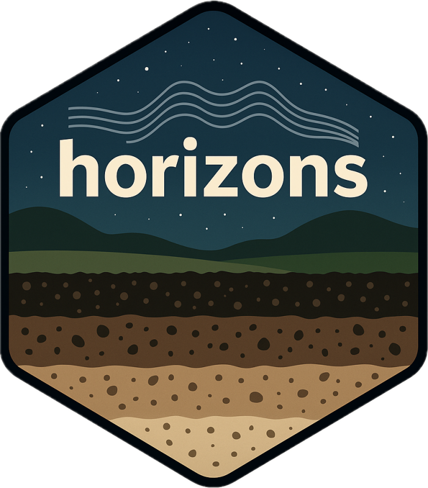

# horizons

> Spectral Ensemble Modeling for Soil Property Prediction



[](LICENSE.md)
[](https://github.com/S-Leuthold/horizons/actions/workflows/R-CMD-check.yaml)
[](https://codecov.io/gh/S-Leuthold/horizons)
[](https://lifecycle.r-lib.org/articles/stages.html)

---

## Overview

`horizons` is an R package for predicting soil properties from mid-infrared (MIR) spectra. Built on the `tidymodels` ecosystem, it provides end-to-end workflows for spectral preprocessing, model training, hyperparameter tuning, and ensemble stacking.

The package supports two prediction modes:

- **Custom Training**: Build and evaluate models on your own calibration data with systematic hyperparameter optimization and ensemble stacking
- **Library Prediction** *(in development)*: Leverage pre-trained models built on the Open Soil Spectral Library (OSSL) for rapid prediction of common soil properties with uncertainty quantification

Designed for soil scientists and environmental researchers, `horizons` emphasizes reproducibility, modularity, and scalability from desktop to HPC environments.

---

## Installation

```r
# Install from GitHub
remotes::install_github("S-Leuthold/horizons")
```

---

## Key Features

### Data Ingestion
- Read OPUS files directly with automatic metadata extraction
- Flexible filename parsing for sample identification
- Merge spectral data with laboratory measurements

### Spectral Preprocessing
- Standard Normal Variate (SNV) normalization
- Savitzky-Golay smoothing and derivatives
- Multiplicative Scatter Correction (MSC)
- Baseline correction methods

### Model Training
- Nine supported algorithms: Random Forest, Cubist, XGBoost, PLSR, Elastic Net, SVM, MARS, MLP, LightGBM
- Two-stage hyperparameter tuning (grid search + Bayesian optimization)
- Cross-validation with stratified or grouped folds
- Parallel execution (local multi-core or HPC clusters)

### Ensemble Methods
- Stacked ensemble models using `stacks`
- Weighted model averaging
- Automatic model selection based on performance metrics

### Covariate Integration
- Predict soil covariates (pH, clay, sand) from spectra using OSSL-trained models
- Fetch climate data (MAT, MAP, GDD) from Daymet API
- Incorporate covariates into prediction models

### Performance Metrics
- Standard metrics: RMSE, R², MAE
- Spectroscopy-specific: RPD (Ratio of Performance to Deviation), RPIQ
- Agreement metrics: Concordance Correlation Coefficient (CCC)
- Relative metrics: RRMSE (Relative RMSE)

---

## Quick Start

```r
library(horizons)

# Define project structure
projects <- project_list(
 "my_study" = project_entry(
   spectra_path        = "path/to/opus_files/",
   sample_obs          = "path/to/lab_data.csv",
   file_name_format    = "project_sampleid_replicate",
   file_name_delimiter = "_"
 )
)

# Load and preprocess data
project_data <- create_project_data(
 projects  = projects,
 variables = "total_carbon"
)

# Configure model grid
configs <- create_project_configurations(
 project_data    = project_data,
 models          = c("random_forest", "cubist", "xgboost"),
 transformations = c("None", "Log"),
 preprocessing   = c("snv", "snv_d1")
)

# Run evaluation
evaluate_models_local(
 config     = configs,
 input_data = project_data,
 output_dir = "results/"
)

# Build ensemble
ensemble <- build_ensemble_stack(
 results_dir = "results/",
 input_data  = project_data,
 n_best      = 10
)
```

---

## Roadmap

### Current (v0.9.0)
- Custom training mode with full ensemble pipeline
- Local and HPC execution backends
- 80%+ test coverage

### In Development
- **Library Prediction Mode**: Pre-trained models for 15 standard soil properties
- **Uncertainty Quantification**: Per-sample prediction intervals with conformal calibration
- **Applicability Domain**: Distance-based reliability metrics for new samples

### Planned
- JOSS publication
- Vignettes with reproducible examples
- Instrument calibration transfer methods

---

## Citation

If you use `horizons` in your research, please cite:

```
Leuthold, S. (2025). horizons: Spectral Ensemble Modeling for Soil Property
Prediction. R package version 0.9.0. https://github.com/S-Leuthold/horizons
```

---

## Contributing

Contributions are welcome. Please open an issue to discuss proposed changes or submit a pull request.

---

## License

MIT © 2025 Sam Leuthold
